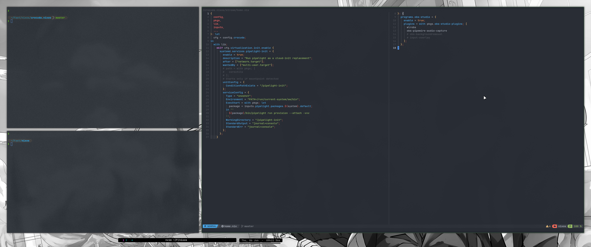

# crocuda.nixos

...is a set of **nixos modules** which provide trivial configuration for
**paranoids** and **hypocondriacs**.

## Motivations

This project aim is to provide a well-documented NixOs base configuration with:

- **security and privacy**.
- **keyboard first** apps (qwerty, colemak-dh).

It is devided in **modules** that can be cherry picked or copy/pasted and
modified at your will.

## Configuration directory architecture

This flake makes a heavy use of [home-merger](https://github.com/pipelight/nixos-utils) to
keep config files in separate dotfiles in their original formats, and keep a
consistent file tree.

## Installation and Usage (Flake)

Setting up a user is sufficient to get you up and running on a fresh nixos
installation.

Enable the software you whish to use via the module options and you are done.
Refer to `default.nix` for the list of all available options.

```nix
# crocuda.nix
{
  config,
  pkgs,
  inputs,
  ...
}: {
  crocuda = {
    users = ["anon"];

    keyboard.layout = "colemak-dh";

    base.enable = true;

    # Graphical
    wm.hyprland.enable = true;

    # Terminal stuffs
    terminal = {
      shell = {
        fish.enable = true;
      };
      editor = {
        nvchad.enable = true;
        vim.enable = true;
      };
      file_manager = {
        yazi.enable = true;
      };
    };

    browser = {
      firefox.enable = true;
      searxng.enable = true;
      i2p.enable = true;
      tor.enable = true;
    };

    finance = {
      monero.enable = false;
      darkfi.enable = false;
    };
  };
}
```

Then import the module and its configuration file from your flake.nix.

```nix
# flake.nix
nixosConfigurations = {
  # CrocudaVM config
  my_machine = pkgs.lib.nixosSystem {
    specialArgs = {inherit inputs;};
    modules = [
        # Import the module
        crocuda.nixosModules.default
        # Import your configuration for this module
        ./crocuda.nix
    ];
  };
};
```

```sh
nixos-rebuild switch
```

## What is inside ?

### Normy stuffs

Internet navigation:

- firefox security enhanced: with an hardened version of arkenfox
- secure dns: with bind9 dns over https
- search engine: searxng search engine configuration.

Simple tools for everyday usage.

Password manager:

- KeepassXC (custom security centric layout)

### WM: A hyprland rice to use at your own risks.



### Per layout configurations.

Every command-line tool that has vim specific bindings has been customized to be usable with:

- Qwerty
- Azerty
  and
- Colemak-dh
